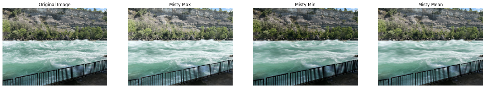

# Misty Water Effect

Project: https://github.com/SamuelLin111/Misty-Water-Effect

1. What is this project about?:
    - This project is about creating the misty water effect in a picture. 
2.  First, input a burst of photos. A burst of photos are multiple photos taken in a really short span of time. Next, there are three ways you can achieve the misty water effect:
    - Way 1: Average:
      - Make each pixel in the blank image the average of all the same pixels in each imputed pictures.
    - Way 2: Find the biggest value:
      - Make each pixel in the blank image the largest value of all pixels in the same position from the imputed pictures.
    - Way 3: Find the smallest value:
      - Make each pixel in the blank image the smallest value of all the same pixels in each imputed pictures.
    - Example: https://github.com/SamuelLin111/Misty-Water-Effect/blob/main/Misty-Water-Effect%20Example%201.png
3. What is the effect of the number of images on the misty water effect? For example, if I use 10 images vs. 4 images, what do you expect the difference to be?:
    - If there are more images, the water would look more filled in and even. This is especially apparent in waterfalls. 
4. Does the misty water effect also alter static objects such as trees and cliffs in the background? Why or why not?:
    - The misty water effect does not affect static objects because the burst is taken over a short span of time. Only fast motions like the water would be captured in the burst. Object that remain static during the burst will not be affected.
    - Example: https://github.com/SamuelLin111/Misty-Water-Effect/blob/main/Misty-Water-Effect%20Example%202.png
  
